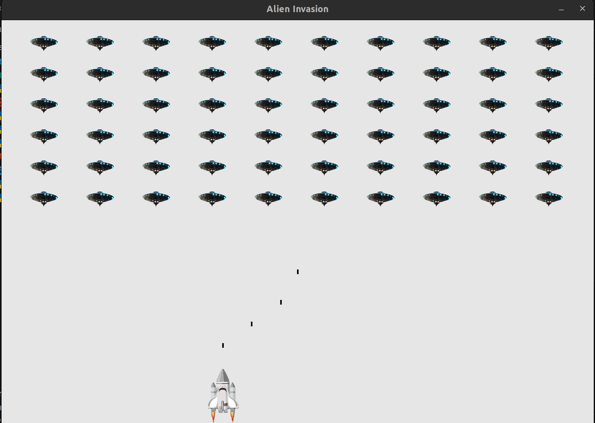

# 👾 Alien Invasion Game

Welcome to **Alien Invasion**, a classic-style arcade shooter game where you defend Earth from waves of alien invaders!<br>
**🛠️ Built with Python and Pygame**

---

## 📸 Screenshot

  
*An epic space battle in progress!*

---

## 🚀 Game Overview

You control a **rocket ship** stationed at the bottom center of the screen. Your mission? Defend against incoming alien fleets!

### 🎮 Controls

- **Move Left:** ← Arrow Key  
- **Move Right:** → Arrow Key  
- **Shoot Bullets:** Spacebar  

### 🛸 Gameplay

- At the start, a fleet of aliens appears and begins moving **horizontally** and **downward** across the screen.
- Use your ship to **fire bullets** and destroy the aliens.
- Once you destroy all the aliens:
  - A new, **faster** fleet appears.
  - The challenge increases with each wave!

### 💥 Game Over Conditions

- You **lose a ship** if:
  - An alien collides with your ship.
  - An alien reaches the **bottom** of the screen.
- Lose **3 ships** and it's **game over**!


## 🕹️ How to Play

1. **Start the game** and get ready for incoming alien fleets.
2. Use arrow keys to move your ship **left** and **right**.
3. Press the **spacebar** to fire bullets upward.
4. **Shoot all the aliens** before they reach the bottom or hit your ship.
5. After clearing a fleet, a **faster** fleet appears.
6. You have **3 lives**—lose them all and it's **game over**!

### **Ready to defend the Earth? Power up your ship and start blasting!**
---

## 💻 Installation

### 🔧 Requirements
- Python 3.6+
- [Pygame](https://www.pygame.org/)

### 📦 Setup

1. **Clone the repository**
   ```bash
   git clone https://github.com/yourusername/alien-invasion.git
   ```
   ```bash
   cd alien-invasion
    ```
2. **Install pygame**
    ```bash
    pip install pygame
    ```
3. **Run The Game**
    ```bash
    python alien_invasion.py
    ```


## 📁 Project Structure

- `alien_invasion.py` – Main game loop and execution entry point.
- `settings.py` – Stores game settings (screen size, speed, etc.).
- `game_stats.py` – Tracks game statistics (score, lives, etc.).
- `scoreboard.py` – Displays the score and lives on screen.
- `ship.py` – Handles the player's ship.
- `alien.py` – Controls alien behavior.
- `bullet.py` – Manages bullets fired by the player.
- `button.py` – Defines buttons (e.g., Play button).
- `images/` – Contains image assets like `ship.bmp`.
- `sounds/` – Stores sound effects like `laser.wav`.
- `screenshots/` – Contains screenshots for documentation.
- `README.md` – Project documentation.


<!-- ## 📁 Project Structure

alien-invasion/
├── alien_invasion.py
├── settings.py
├── game_stats.py
├── scoreboard.py
├── ship.py
├── alien.py
├── bullet.py
├── button.py
├── images/
│ └── ship.bmp
├── sounds/
│ └── laser.wav
├── screenshots/
│ └── alien_invasion_demo.png
└── README.md -->